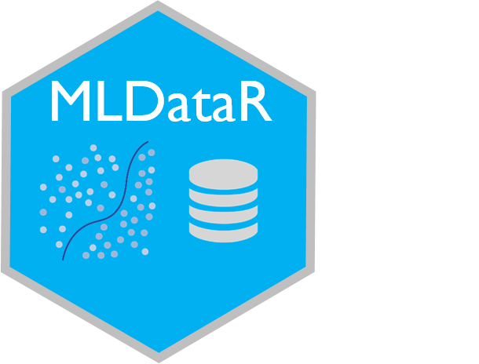

# MLDataR

<p><a href="https://hutsons-hacks.info/"></a></p>

 <!-- badges: start -->
  [](https://github.com/StatsGary/MLDataR/actions)
  [](https://cran.r-project.org/package=MLDataR)
   [](https://CRAN.R-project.org/package=MLDataR) 
  
  
  [](https://cran.r-project.org/package=MLDataR)
  [](https://github.com/ald0405/SangerTools/blob/master/LICENSE)
  <!-- badges: end -->

A collection of Machine Learning datasets for health care and beyond.

## Installing the package from GitHub

Here, I will use the package remotes to install the package:

``` r
# install.packages("remotes") # if not already installed
remotes::install_github("https://github.com/StatsGary/MLDataR")
library(MLDataR)

```
## Installing the package from CRAN

To install from CRAN, use the below command:
``` r
install.packages("MLDataR")

```

## Loading the package from CRAN

To load the package from CRAN, use the following:

``` r
library(MLDataR)
```

## Datasets included

The package currently has three example datasets, and more are being added every week. The first three datasets contained in the package are:

- Diabetes disease prediction - supervised machine learning classification dataset to enable the prediction of diabetic patients
- Diabetes onset prediction - supervised machine learning regression dataset to enable prediction of the age at which a pre-diabetic will develop diabetes 
- Heart disease prediction - supervised machine learning classification dataset to enable the prediction of heart disease using a number of key outcome features
- Thyroid disease prediction - supervised machine learning classification dataset to allow for the prediction of thyroid disease utilising historic patient records
- Failing Care Home classification - classification supervised machine learning dataset to predict a failing care home by selected Datix incidents

## Further developments

More datasets are being added, so look out for the next version of this package. 

## Closing remarks

It has been fun putting this package together and I hope you find it useful. If you find any issues using the package, please raise a git hub ticket and I will address it as soon as possible. 
